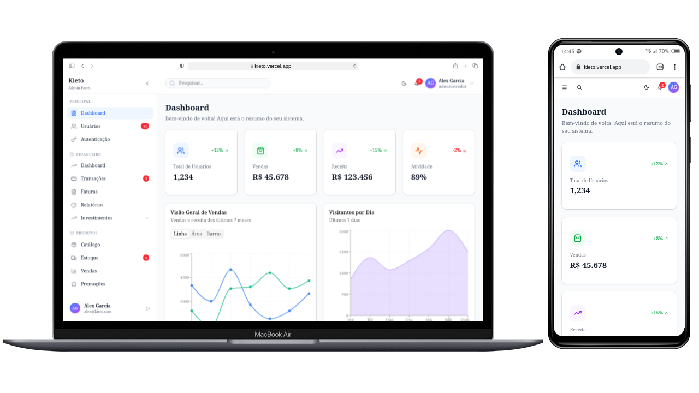

# 🎨 NEXT-KIETO-UI

This project is a **Next.js application** focused on building a **modern and reusable dashboard interface**.  
The goal is to practice **clean frontend architecture**, explore **intuitive design system patterns**, and deliver a refined visual experience for study and portfolio purposes.

---

## 🚀 Technologies Used

- Next.js (App Router)  
- TypeScript  
- TailwindCSS  
- PostCSS  
- ESLint & Prettier  
- Shadcn UI  

---

## 🎨 Highlights

- Modular and reusable UI components  
- Light/dark theme support with TailwindCSS  
- Clean and scalable folder structure  
- CI/CD with GitHub Actions (build, lint, test)  
- Documentation in `docs/` for setup and architecture  

---

## 📄 Documentation

- [Architecture](./docs/architecture.md)  
- [Setup Guide](./docs/setup.md)  

---

## 🌐 Access

- **Local:** [http://localhost:3000](http://localhost:3000)  
- **Remote:** [https://kieto.vercel.app/](https://kieto.vercel.app/)  

---

## 📸 Demo

---

## 👨‍💻 Author
**Domingos Nascimento (Adyllsxn)**  

- [LinkedIn](https://www.linkedin.com/in/adyllsxn/)  
- [GitHub](https://github.com/Adyllsxn)  

---

## 📄 License

- This project is for educational and portfolio purposes only.
